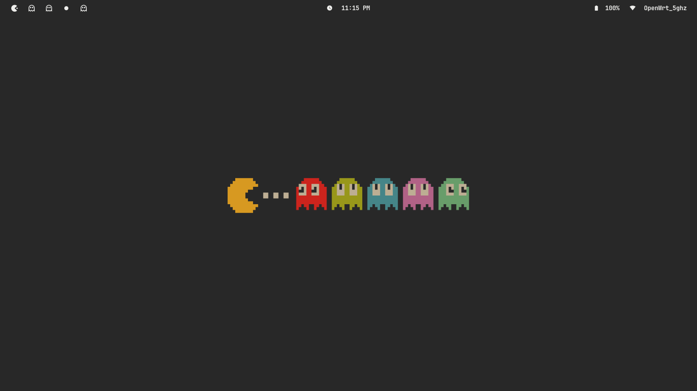

# dotfiles

This repository contains my personal dotfiles.



## My setup

**Desktop Environment:** [`Hyprland`](hypr/README.md)  
**Shell:** [`bash`](bashrc.d/README.md)  
**Terminal:** `kitty`  
**Terminal Multiplexer:** [`tmux`](tmux/README.md)  
**Text Editor:** `neovim`  
**Colorscheme:** `Gruvbox Material`

### neovim

#### nvim

Neovim default

#### lazyvim

Neovim distro + additional plugins  
**Theme:** Gruvbox Material  

## Installation

Clone repository
```bash
git clone https://github.com/4lexandrei/dotfiles.git ~/.dotfiles
```
## Usage

run dotfiles setup command
```bash
~/.dotfiles/bin/dotfiles
```

> [!NOTE]
> Select:
> ```bash
> ./main.sh # Symlinks repository dotfiles to your system.
> ```
> ```bash
> ./nvim.sh # Sets up neovim.
> ```

---

## Windows Support

For Windows users, open Powershell as Administrator and run the following snippet to create symlinks
```powershell
New-Item -ItemType SymbolicLink -Path "link" -Target "path_to_link"
```

Examples:
SymbolicLink for lazyvim
```powershell
New-Item -ItemType SymbolicLink -Path "C:\Users\alexa\AppData\Local\nvim" -Target "C:\Users\alexa\.dotfiles\nvim\lazyvim"
```
SymbolicLink for .bashrc
```powershell
New-Item -ItemType SymbolicLink -Path "C:\Users\alexa\.bashrc" -Target "C:\Users\alexa\.dotfiles\bash\.bashrc"
```
